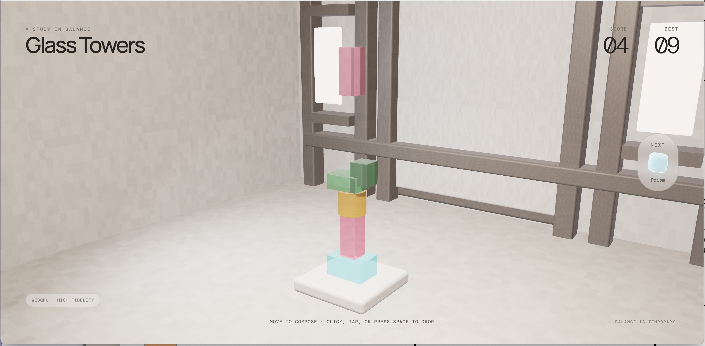

# Glass Towers



Glass Towers ist ein minimalistisches 3D-Browserspiel über Balance, Komposition und den unvermeidlichen Moment, in dem eine fragile Skulptur kippt. WebGPU wird für die hochwertige Darstellung bevorzugt; falls es nicht verfügbar ist oder nicht stabil initialisiert werden kann, verwendet dieselbe Three.js-Szene automatisch WebGL2.

## Spielziel

Bewege den nächsten Glasstein horizontal über die Skulptur und lasse ihn im richtigen Moment fallen. Jeder stabilisierte Stein erhöht den Score um einen Punkt. Ziel ist es, den höchsten stabilen Turm zu bauen.

Der Durchlauf endet, sobald ein Stein den Sockel verfehlt oder die Skulptur so instabil wird, dass ein Teil herunterfällt. Der persönliche Bestwert bleibt lokal im Browser gespeichert.

## Steuerung

| Eingabe | Aktion |
|---|---|
| Klicken oder mit gedrückter Maustaste ziehen und loslassen | Aktiven Stein positionieren und fallen lassen |
| Touch ziehen und loslassen | Aktiven Stein positionieren und fallen lassen |
| `←` / `→` | Stein schrittweise horizontal bewegen |
| `Space` | Stein fallen lassen |
| `R` oder `Enter` | Nach Game over neu starten |
| **Build again** | Neuen Durchlauf über die sichtbare Schaltfläche starten |

## Features

- Physikbasiertes Stapeln mit Rapier und unterschiedlichen Formen, Größen und Schwerpunkten
- Fünf klar unterscheidbare Glasfarben mit backendgerechten Materialprofilen
- Transparenz, Reflexionen, weiches Studiolicht und eine vollständig gerenderte Galerie
- Dynamische Kameraführung, die dem wachsenden Turm nach oben und einem Kollaps kontrolliert nach unten folgt
- Responsive Safe Frames für Desktop, Hochformat und kleine Viewports
- Score, lokal gespeicherter Bestwert und Vorschau des nächsten Steins
- Kontrollierter Game-over-Zustand mit sofortigem Neustart
- Maus-, Touch- und Tastatursteuerung
- Unterstützung für `prefers-reduced-motion`

## Grafikmodi und Browser

Das Badge unten links zeigt den aktiven Renderer:

- **WebGPU · High fidelity:** bevorzugter Modus mit hochwertiger Glas- und Lichtdarstellung.
- **WebGL2 · Compatible:** automatischer Kompatibilitätsmodus, unter anderem für Safari-Systeme ohne nutzbares WebGPU.

Wenn weder WebGPU noch WebGL2 initialisiert werden kann, zeigt das Spiel einen erklärenden Fehlerzustand mit erneutem Versuch. In diesem Fall helfen meist ein aktueller Browser und aktivierte Hardwarebeschleunigung.

## Entwicklung

```bash
npm install
npm run dev
```

## Qualitätsprüfungen

```bash
npm run lint
npm test
npm run test:integration
npm run test:e2e
npm run build
```

Die Browser-Suite deckt das automatische Backend, erzwungenes WebGL2, vollständiges Renderer-Scheitern, Eingabekanäle, Glasmaterialien, Galerie, Kameraführung sowie Performanceproben mit bis zu 20 Rapier-Bodies ab. Die Query-Parameter `renderer`, `seed` und `stress` sind ausschließlich im Development-Build aktiv.
